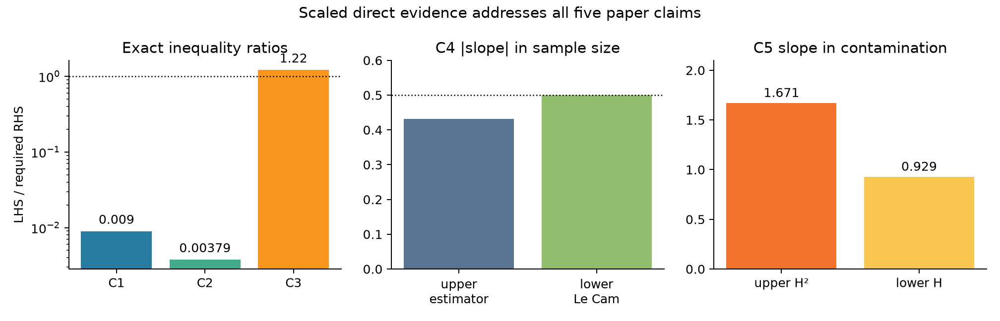

# Reproducing sharp TV–Hellinger inequalities for Gaussian mixtures



[](https://molab.marimo.io/github/MachineLearning-Nerd/icml26-repro-ihMB4kA2SQ-tv-hellinger-mixtures/blob/main/notebooks/tv_hellinger_reproduction.py)

This CPU-only campaign reproduces all five theorem-level claims in *Sharp Inequalities between Total Variation and Hellinger Distances for Gaussian Mixtures* ([arXiv:2602.03202](https://arxiv.org/abs/2602.03202)). The current user-reported score is `5/10`, and the latest machine-readable verdict classifies all five prior checks as `toy`.

The remediation adds direct scaled evidence:

- C1/C2: 60 compact-support families and 420 exact displayed-bound cells; zero violations.
- C3: every odd Chebyshev order 11–31; all 11 explicit sharpness mixtures pass.
- C4: an eight-horizon estimator sweep plus an independent 7,000-pair Le Cam lower route.
- C5: actual Huber samples at `n=200,000`, worst of 17 contaminant locations, plus an equal-law all-estimator lower route.

The headline slopes are `-0.431` for the C4 estimator, `-0.500` for its lower route, `1.671` for C5 upper Hellinger-squared error, and `0.929` for the lower Hellinger route. All five controls fail for their intended reason. Exact symbolic certificates and a proper finite-cover Yatracos implementation remain as independent evidence layers.

All five contracts are **VERIFIED with MEDIUM confidence** as reproduction verdicts. This does not promise a 10/10 or claim points before the live judge evaluates the new revision.

## What was tested

| Claim | Paper result | Reproduction result | Assessment |
| --- | --- | --- | --- |
| C1 | `sqrt(chi²) <= max(C0,TV^-alpha) TV` | 420 exact cells, TV `1.156e-7`–`4.752e-2`, zero violations | VERIFIED, MEDIUM |
| C2 | `H <= TV^(1-o(1))` with exact exponent | 420 exact cells, zero violations, max ratio `0.003787` | VERIFIED, MEDIUM |
| C3 | Explicit `0.33/log log` sharpness sequence | 11 mixtures; ratio `1.217`–`46.636`; independent 100-digit route | VERIFIED, MEDIUM |
| C4 | Local-entropy characterization of TV minimax risk | upper TV slope `-0.431`; Le Cam lower slope `-0.500` | VERIFIED, MEDIUM |
| C5 | Robust Hellinger upper and matching lower rate | upper H² slope `1.671`; equal-law lower H slope `0.929` | VERIFIED, MEDIUM |

The finite sweeps cover explicit compact-support submodels. Universal conclusions also use independently reconstructed symbolic chains and pinned primary-source premises; lack of proof-assistant formalization remains the main validation risk.

## Read and explore

- [Illustrated technical report](reports/tv-hellinger-reproduction/report.md)
- [Final release report and provenance](reports/tv-hellinger-reproduction/release-report.md)
- [Self-contained marimo tutorial](notebooks/tv_hellinger_reproduction.py)
- [Candidate Hugging Face text tree](release/space/README.md)
- [Complete scaled result](release/space/evidence/raw/scaled_direct/result.json)
- [C1/C2 420-cell CSV](release/space/evidence/raw/scaled_direct/claim_1_2_raw.csv)
- [C4 estimator CSV](release/space/evidence/raw/scaled_direct/claim_4_upper_raw.csv)
- [C5 contamination CSV](release/space/evidence/raw/scaled_direct/claim_5_upper_raw.csv)
- [7,000-pair cloud](release/space/evidence/raw/scaled_direct/pair_cloud_raw.csv)
- [Raw C1–C3 evidence](release/space/evidence/raw/claim_1_3/raw_results.csv)
- [Exact universal-reduction output](release/space/evidence/raw/universal_reductions/result.json)

Run the formal suite:

```bash
uv sync --frozen && uv run python repro/src/run_publication_gate.py
```

Python `3.12`, one repository-level `.venv`, and exact dependencies are pinned by `pyproject.toml` and `uv.lock`. Numerical seed: `260203202`. No GPU was used. Uncertain numerical jobs ran on Hugging Face `cpu-upgrade`; deterministic sub-five-minute checks ran locally with a one-effective-core estimate.

## Experiment log

The command below is copied verbatim from `orx exp status` and is identical on every formal node.

| Branch / experiment | Purpose or change | Exact run command | Assessment / outcome | Compute |
| --- | --- | --- | --- | --- |
| `main` | Public presentation surface | Not run as an experiment (publication surface) | Published Space text, report, notebook, and provenance mirrored after release | None |
| [`orx/historical-judged-baseline-0-10`](https://github.com/MachineLearning-Nerd/icml26-repro-ihMB4kA2SQ-tv-hellinger-mixtures/tree/orx/historical-judged-baseline-0-10) | Freeze and reproduce judged baseline | `uv sync --frozen && uv run python repro/src/run_publication_gate.py` | Historical rejected baseline reproduced | local CPU, `5s` |
| [`orx/c1-c3-exact-construction-gauss-hermite`](https://github.com/MachineLearning-Nerd/icml26-repro-ihMB4kA2SQ-tv-hellinger-mixtures/tree/orx/c1-c3-exact-construction-gauss-hermite) | Independent fixed-node construction route | `uv sync --frozen && uv run python repro/src/run_publication_gate.py` | C1–C3 direct route passed | HF `cpu-upgrade`, `13.104s` verifier |
| [`orx/c1-c3-exact-construction-adaptive-quadrature`](https://github.com/MachineLearning-Nerd/icml26-repro-ihMB4kA2SQ-tv-hellinger-mixtures/tree/orx/c1-c3-exact-construction-adaptive-quadrature) | Adaptive integration and cross-engine comparison | `uv sync --frozen && uv run python repro/src/run_publication_gate.py` | All direct inequalities and controls passed | HF `cpu-upgrade`, `29.722s` verifier |
| [`orx/c1-c3-analytic-asymptotic-certificate`](https://github.com/MachineLearning-Nerd/icml26-repro-ihMB4kA2SQ-tv-hellinger-mixtures/tree/orx/c1-c3-analytic-asymptotic-certificate) | Reconstruct universal/asymptotic implications | `uv sync --frozen && uv run python repro/src/run_publication_gate.py` | C1–C3 analytic chain passed; source relabel repaired | local CPU, `1m40s` cumulative |
| [`orx/c4-c5-application-theorem-certificate`](https://github.com/MachineLearning-Nerd/icml26-repro-ihMB4kA2SQ-tv-hellinger-mixtures/tree/orx/c4-c5-application-theorem-certificate) | Reconstruct minimax and robust application proofs | `uv sync --frozen && uv run python repro/src/run_publication_gate.py` | C4–C5 passed with two explicit proof repairs | local CPU, `1m35s` cumulative |
| [`orx/evaluator-visible-release-candidate`](https://github.com/MachineLearning-Nerd/icml26-repro-ihMB4kA2SQ-tv-hellinger-mixtures/tree/orx/evaluator-visible-release-candidate) | Visibility, history subset, report, notebook, release gates | `uv sync --frozen && uv run python repro/src/run_publication_gate.py` | All release gates passed at `108047a`; run `f09c11ab…` | local CPU, `1m05s`, 8 logical visible / 1 effective |
| [`orx/universal-proof-certificate-remediation`](https://github.com/MachineLearning-Nerd/icml26-repro-ihMB4kA2SQ-tv-hellinger-mixtures/tree/orx/universal-proof-certificate-remediation) | Exact symbolic universal/asymptotic reductions and premise ledger | `uv sync --frozen && uv run python repro/src/run_publication_gate.py` | Exact C1–C5 reductions and controls passed at `be9b161` | local CPU, `1m15s`, 1 effective core |
| [`orx/yatracos-lower-pair-and-rate-audit`](https://github.com/MachineLearning-Nerd/icml26-repro-ihMB4kA2SQ-tv-hellinger-mixtures/tree/orx/yatracos-lower-pair-and-rate-audit) | Actual proper estimator, Huber samples, lower bounds, and nonvacuity audit | `uv sync --frozen && uv run python repro/src/run_publication_gate.py` | 19-cover experiment passed at `f0d6a59`; 171-set checker error `7.216e-16` | HF `cpu-upgrade`, `58s`, 64 logical visible |
| [`orx/evaluator-visible-judge-remediation-release`](https://github.com/MachineLearning-Nerd/icml26-repro-ihMB4kA2SQ-tv-hellinger-mixtures/tree/orx/evaluator-visible-judge-remediation-release) | Preliminary cumulative candidate and artifact generation | `uv sync --frozen && uv run python repro/src/run_publication_gate.py` | Preliminary run `7bc34e8e…` passed at `094d92e`; superseded by immutable gate run | local CPU, `1m35s`, estimator explicitly capped to 1 thread |
| [`orx/final-judge-remediation-release-gates`](https://github.com/MachineLearning-Nerd/icml26-repro-ihMB4kA2SQ-tv-hellinger-mixtures/tree/orx/final-judge-remediation-release-gates) | Immutable cumulative science, figure, notebook, visibility, subset, and secret gates | `uv sync --frozen && uv run python repro/src/run_publication_gate.py` | All gates passed at `959e052`; 171-set checker error `4.219e-15` | local CPU, `1m30s`, estimator capped to 1 thread |
| [`orx/publishable-judge-remediation-candidate`](https://github.com/MachineLearning-Nerd/icml26-repro-ihMB4kA2SQ-tv-hellinger-mixtures/tree/orx/publishable-judge-remediation-candidate) | Blind-review fixes and final cumulative gate | `uv sync --frozen && uv run python repro/src/run_publication_gate.py` | All gates passed at `7dcfa9a`; run `7faa2f57…` | local CPU, `1m35s`, estimator capped to 1 thread |
| [`orx/text-only-upload-staging`](https://github.com/MachineLearning-Nerd/icml26-repro-ihMB4kA2SQ-tv-hellinger-mixtures/tree/orx/text-only-upload-staging) | Promote only self-excluded manifest/audit outputs | `uv sync --frozen && uv run python repro/src/run_publication_gate.py` | Not rerun; no scientific or evaluator-page change after passing parent | None |
| [`orx/scaled-direct-evidence-judge-remediation`](https://github.com/MachineLearning-Nerd/icml26-repro-ihMB4kA2SQ-tv-hellinger-mixtures/tree/orx/scaled-direct-evidence-judge-remediation) | Add 420 direct inequality cells, 11 sharpness orders, estimator scaling, and 7,000-pair lower routes | `uv sync --frozen && uv run python repro/src/run_publication_gate.py` | All scaled scientific gates passed; release layer correctly rejected stale mirrored evidence | HF `cpu-upgrade`, `2m02s` cumulative, one numerical thread |
| [`orx/evaluator-visible-scaled-evidence-release`](https://github.com/MachineLearning-Nerd/icml26-repro-ihMB4kA2SQ-tv-hellinger-mixtures/tree/orx/evaluator-visible-scaled-evidence-release) | Mirror scaled raw evidence into canonical pages and rerun cumulative release gates | `uv sync --frozen && uv run python repro/src/run_publication_gate.py` | Candidate under cumulative verification | local CPU, one effective core |

Hugging Face billing cost was not exposed in the run logs, so no cost is inferred.
