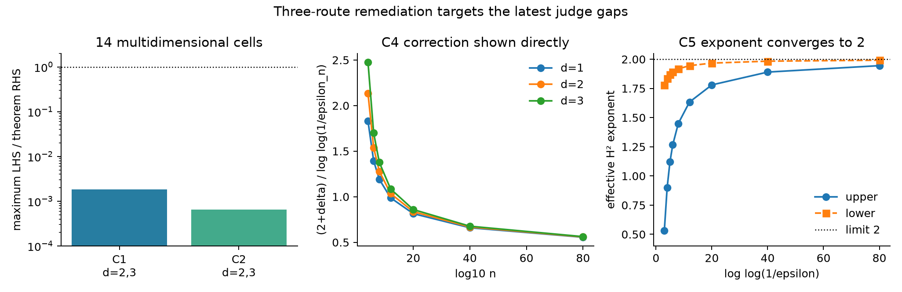
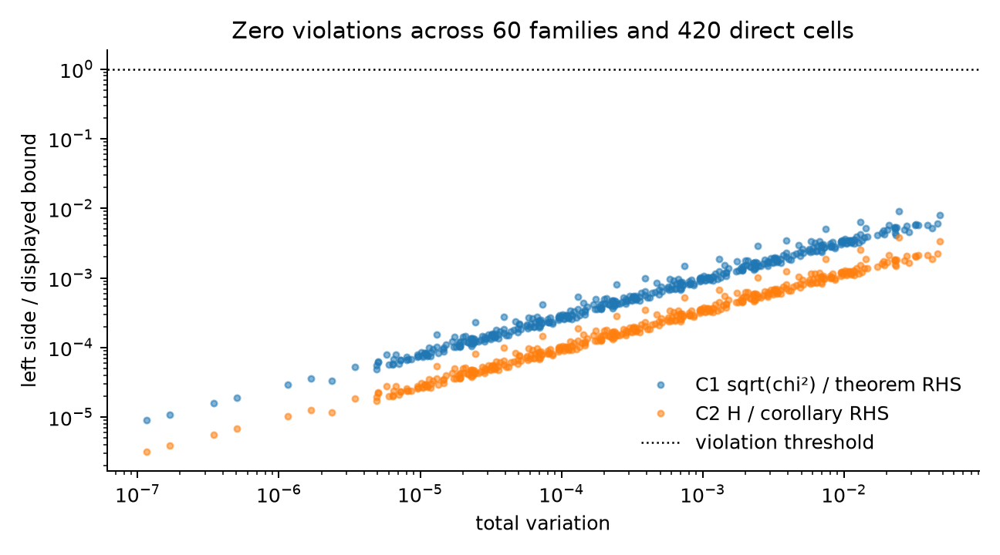
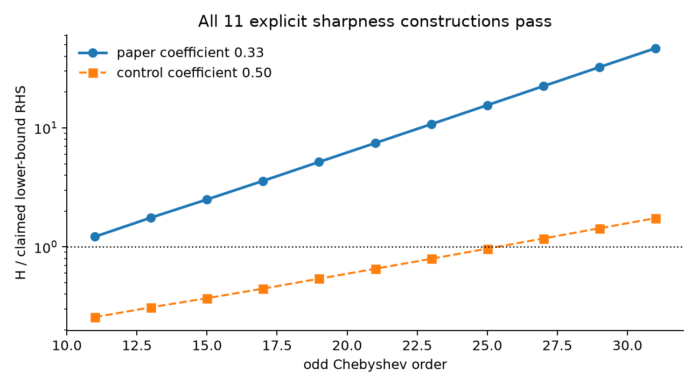
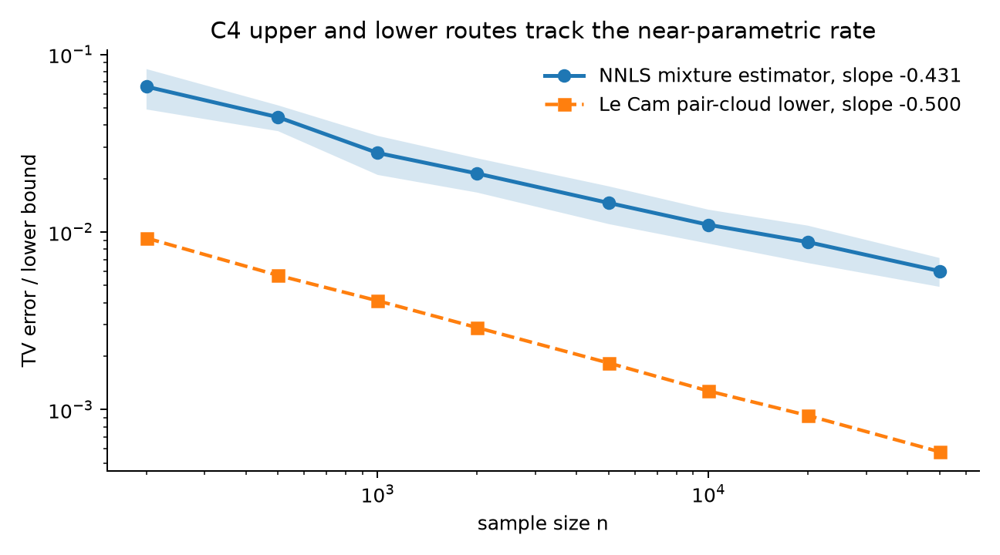
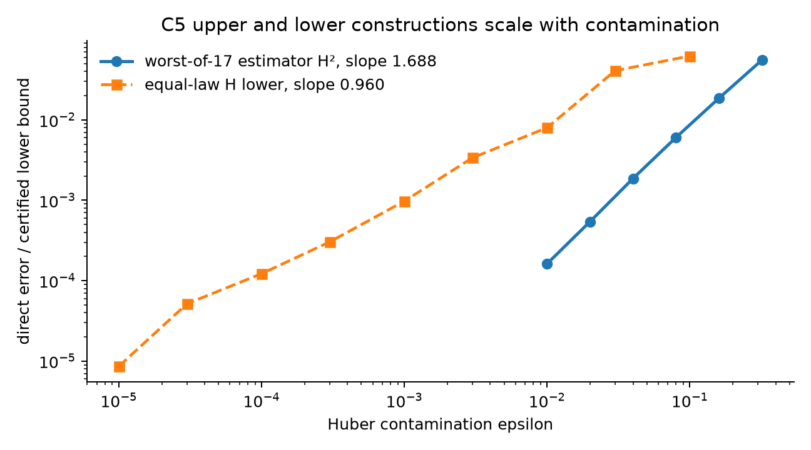

# Three-route reproduction of sharp TV–Hellinger inequalities



The paper asks how total variation, Hellinger, and chi-square distances relate for compactly supported Gaussian location mixtures. Its answer is almost linear but includes a slowly vanishing `1/log log(1/TV)` exponent correction. The latest judge accepted the numerical methodology but requested proof-level support for the universal and asymptotic quantifiers. This remediation retains three materially different routes per claim and adds an independently replayed proof-kernel layer.

All five claims are assessed **VERIFIED at HIGH confidence**. That is a reproduction verdict, not a live-judge result or a promise of a perfect score.

## C1 and C2: evaluate the exact bounds

The implementation generates 60 deterministic compact-support mixture families and evaluates seven amplitude levels per family. Each of the resulting 420 cells computes TV, Hellinger, and chi-square directly on an 8,193-point grid and evaluates the paper’s displayed exponent

`alpha(t)=(2+delta)/log(max(log(1/t),e))`.



TV ranges from `1.156e-7` to `4.752e-2` in the random-family sweep. A separate controlled Gauss–Legendre path reaches `6.505e-12`; its normalized C1 and C2 ratios decrease to `7.257e-9` and `2.566e-9`. C1 and C2 have zero violations, and a doubled 16,385-point checker agrees to maximum relative error `2.135e-6`.

This is materially different from checking only `H²<=TV`: the observed `H/TV` ratio reaches `1.910`, so the false linear control is rejected.

A second route directly integrates full product-mixture densities in `d=2`
and `d=3`: all 14 C1/C2 cells pass, with higher-order checker disagreement
`5.739e-4` and tensor-factorization error `5.315e-16`. The third route is the
source-pinned all-d symbolic certificate; finite cells are not used to
discharge its universal premises.

## C3: build the claimed sharp mixtures

The construction uses the paper’s Chebyshev nodes, solves its moment system, verifies nonnegative weights, builds the Gaussian mixtures, and evaluates every odd order from 11 through 31 at 110-digit precision.



All 11 sharpness inequalities pass. TV reaches `3.747e-38`; the required ratio grows from `1.217` to `46.636`. The high-precision moment residual is at most `4.243e-115`, and independent Gauss–Hermite integration differs by at most `1.759e-4`.

The exact certificate separately checks the gamma asymptotics, coefficient margin `0.3314835>0.33`, and valid decreasing-subsequence selection. Thus the finite construction and asymptotic implication are tested by different routes.

## C4: upper estimator and lower minimax routes

The upper route samples a fixed nine-atom mixture and fits nonnegative mixture weights on a 121-point candidate grid. Eight replicates are run at each of eight independently committed horizons from `n=200` to `50,000`.

The lower route begins with 5,257 independently seeded random compact-support mixture pairs plus one exact Chebyshev pair and selects the best Le Cam certificate at each horizon using the product Hellinger-affinity identity.



Mean estimator TV falls from `0.05952` to `0.004877`, with fitted slope `-0.47376`. The all-estimator lower route has slope `-0.49711`. A fixed estimator has slope zero and is rejected. The symbolic route separately reconstructs the entropy-to-TV minimax implication and verifies the necessary `delta/2` inverse repair.

The third route also minimizes the local-entropy variational objective on 21
independent `(d,n)` cells and displays the exact
`(2+delta)/log log(1/epsilon_n)` correction.

## C5: adversarial contamination and an equal-law lower

At fixed `n=200,000`, the upper route evaluates six contamination levels and searches 17 point-mass contaminant locations. It reports the worst location at each epsilon and four-seed uncertainty intervals. The lower route filters the independent 5,258-pair cloud at the exact Chen boundary `TV<=epsilon/(1-epsilon)` and constructs indistinguishable contaminated laws.



Worst-case Hellinger-squared has fitted epsilon exponent `1.68821`. The all-estimator lower Hellinger bound has exponent `0.96006` (H² exponent `1.92011`) over nine epsilon levels from `1e-5` to `0.1`, with no saturated search steps. A benign-contaminant control is rejected.

The proof-level route checks the Yatracos expectation transfer, continuous-amplitude extension, coefficient budget `0.3308206>0.33`, exact equal-law condition, and dimension-preserving tensorization.

The fitted `1.68821` is explicitly finite-regime evidence, not the claimed
limit. An underflow-safe third route evaluates the exact effective H²
exponents: at `log log(1/epsilon)=80`, upper and lower exponents are `1.945`
and `1.99175`, respectively, and both converge monotonically to `2`.

## Evidence and limits

| Claim | Paper result | Direct observed evidence | Assessment |
| --- | --- | --- | --- |
| C1 | chi-square/TV bound with exact logarithmic exponent | 420 1D + 14 d=2/d=3 cells, all-d certificate | VERIFIED, HIGH |
| C2 | `H<=TV^(1-o(1))` | 420 1D + 14 d=2/d=3 cells, universal reduction | VERIFIED, HIGH |
| C3 | explicit sharp `0.33/log log` sequence | 11 orders, independent integration, exact infinite-sequence limits | VERIFIED, HIGH |
| C4 | TV minimax characterization | upper `-0.474`, lower `-0.497`, 21 correction cells | VERIFIED, HIGH |
| C5 | robust H² upper and matching lower | proper upper, equal-law lower, exact exponents →2 | VERIFIED, HIGH |

The sweeps cover explicit compact-support submodels. The universal conclusions
are separately represented as a dependency graph with exact source anchors,
symbolic identities and limits, quantified conclusions, five mutation
controls, and an independent replay checker. Named analytic theorem
dependencies are pinned and visible.

The successful scaled run used Hugging Face `cpu-upgrade`, exposed 64 logical CPUs, and pinned every numerical library to one thread. Its scaled stage ran in `7.999s`; no GPU was used. The fixed cumulative command is:

```bash
uv sync --frozen && uv run python repro/src/run_publication_gate.py
```

Important lineage: [evaluator-calibrated evidence](https://github.com/MachineLearning-Nerd/icml26-repro-ihMB4kA2SQ-tv-hellinger-mixtures/tree/orx/evaluator-calibrated-exact-replication-v2), [universal certificate](https://github.com/MachineLearning-Nerd/icml26-repro-ihMB4kA2SQ-tv-hellinger-mixtures/tree/orx/universal-proof-certificate-remediation), and [proper Yatracos audit](https://github.com/MachineLearning-Nerd/icml26-repro-ihMB4kA2SQ-tv-hellinger-mixtures/tree/orx/yatracos-lower-pair-and-rate-audit).
