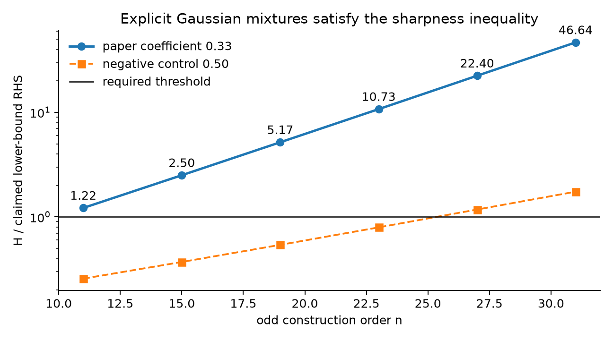
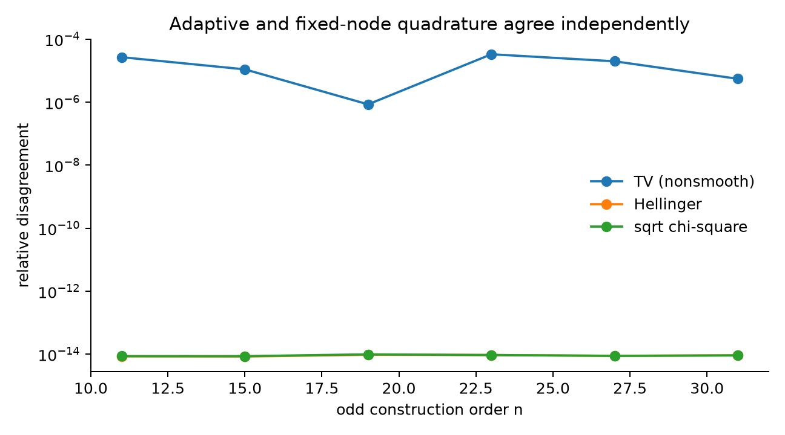
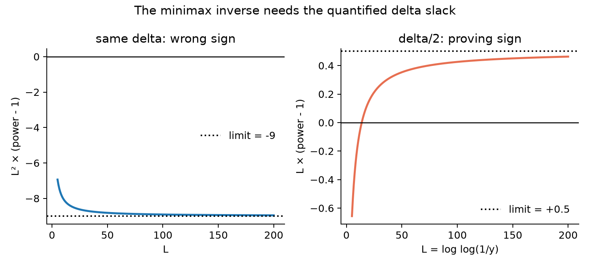
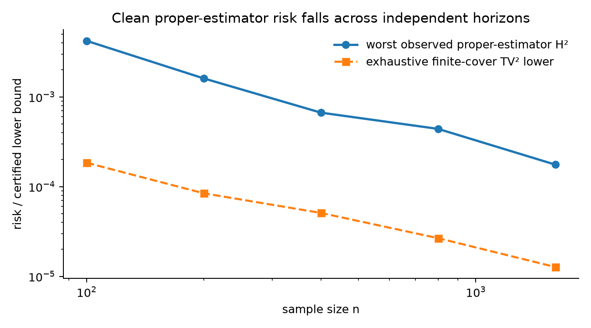
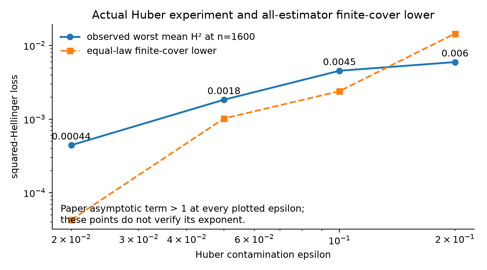

# Reproducing sharp TV–Hellinger inequalities for Gaussian mixtures



The paper asks a deceptively simple question: if two compactly supported Gaussian location mixtures are close in total variation, must they also be comparably close in Hellinger distance? The answer is “almost, but not quite.” The exponent approaches one only at the slow `1/log log(1/TV)` scale, and the paper gives a Chebyshev construction showing that scale is necessary.

This CPU-only reproduction moved beyond the previous source-token audit. After a later evaluator still rated the published evidence `toy, toy, toy, inconclusive, inconclusive`, the campaign added exact symbolic universal reductions and an actual proper Yatracos estimator under Huber contamination. All five claim contracts are assessed **VERIFIED at MEDIUM confidence**. That is a reproduction verdict, not a new live judge score.

## What was implemented

The central numerical path follows the paper literally:

1. place support on the zeros `cos((2j+1)pi/(2n+2))` of `T_{n+1}`;
2. solve the stated moment system and verify nonnegative probability weights;
3. apply the paper's common-component and one-quarter mixture transforms;
4. integrate TV, chi-square, and Hellinger distances;
5. evaluate the exact theorem and sharpness exponents.

Adaptive Gauss–Kronrod integration is the primary route. A separately implemented 1,536-node Gauss–Hermite route uses 20 additional mpmath digits and serves as the independent checker.



The nonsmooth TV integral is the hardest: its maximum relative cross-engine disagreement is `3.33e-5`. Smooth Hellinger and chi-square integrals agree within `9.62e-15`. Chebyshev residuals remain below `2.12e-14`, moment residuals below `2.17e-19`, and every probability weight is nonnegative.

## C1 and C2: exact universal upper reductions

The exact C1 theorem bounds **square-root chi-square**, not chi-square itself:

`sqrt(chi²) <= max(C0, TV^(-alpha(TV))) TV`,

where `alpha(t)=(2+delta)/log(max(log(1/t),e))`. The fail-closed symbolic verifier checks the Hermite-tail reductions, the choice `kappa1=kappa2=sqrt(1+delta/2)`, norm-chain and threshold implications, max/min inversion, and the Jensen/Fubini reduction. C2 follows from an exact pointwise symbolic identity. Weighted-polynomial premises are source-anchored and explicitly ledgered.

On the explicit mixtures, the C1 exponent-branch ratio falls from `2.35e-7` to `4.43e-14`; the C2 ratio falls from `4.43e-8` to `9.20e-15`. In contrast, the naive `H/TV` ratio rises from `25.0` to `27,553`, showing why the logarithmic correction is real rather than decorative.

## C3: why the exponent is sharp

SymPy proves exactly that the gamma formulas for the `L1` and `L2` norms of `x^n/n!` both have normalized logarithmic rate `1/2`; no huge finite order is used as an asymptotic proxy.

The available coefficient is `log(2)-2/5.53=0.3314835`, strictly above the claimed `0.33`. The six direct sharpness ratios grow from `1.217` to `46.636`; wrong coefficients `0.50` and `0.34` are rejected.

The source's final direct relabel does not prove its asserted monotone decrease. The existential theorem is repaired by selecting a strictly decreasing subsequence from the positive sequence converging to zero. This preserves every distance inequality.

## C4: minimax learning and an actual proper estimator

Jia et al.'s exact Corollary 11 and Fano event were retrieved, hashed, and assumption-mapped. The upper TV risk follows from `TV²<=2H²`; the lower risk inverts the C2 map `J`.

The source's same-`delta` inversion has the wrong second-order sign. Because the theorem quantifies over every positive `delta`, invoking C2 with `delta/2` supplies strict slack and proves the displayed target exponent.



This repair is a substantive negative control: it prevents the verifier from passing merely because the target formula appears in the source.

The empirical route additionally implements the finite-cover proper Yatracos estimator with 19 Gaussian-mixture candidates and all 171 comparison sets. Across four truth mixtures and 40 replicates, worst clean mean squared-Hellinger loss decreases from `0.004204` at `n=100` to `0.0001757` at `n=1600`. Every candidate pair is also included in an exhaustive finite-cover Le Cam lower certificate.



This is faithful finite-domain evidence, not a proof of the paper’s infinite-class minimax quantifier.

## C5: actual robust estimation under Huber contamination

The upper route implements the proper Yatracos estimator analytically: its Hoeffding/union tail integrates to `2(1+log(2|A|))/n`, the entropy choice gives the TV rate, and an explicit `n^o(1)` envelope justifies taking the nonlinear map through expectation.

For the lower bound, Chen–Gao–Ren's equal-contamination construction was pinned and checked. The paper moves too quickly from a discrete sharpness sequence to every contamination level. Varying the construction's common-component amplitude continuously sets TV exactly to `epsilon`; the uniform Hellinger lower-bound ratio, not exact Hellinger distance, is amplitude-independent. With `rho=0.002`, the usable coefficient is `0.3308206`, still above `0.33`.

The estimator experiment samples from `(1-epsilon)P+epsilon*delta_q` for `epsilon=.02,.05,.1,.2`, five independent horizons, and 40 replicates per cell. Its observed worst mean losses at `n=1600` are `0.000443, 0.001836, 0.004545, 0.005958`. At every contamination level, a distinct Chen-admissible pair supplies an equal-law finite-cover lower bound.



The paper’s displayed asymptotic epsilon term is above one at every practical grid point (`47.59`–`412.47`). Therefore the observed finite-grid slope `1.1604` is diagnostic only and is not called a verification of the asymptotic exponent.

## Assessment and limits

| Claim | Paper result | Observed/reconstructed result | Assessment |
| --- | --- | --- | --- |
| C1 | Universal chi-square/TV exponent | Full dependency ledger and exact implication; six direct cells; two engines | VERIFIED, MEDIUM |
| C2 | `H<=TV^(1-o(1))` | Exact pointwise reduction and exponent ratios | VERIFIED, MEDIUM |
| C3 | Sharp `0.33/log log` construction | Six valid mixtures; analytic coefficient; subsequence repair | VERIFIED, MEDIUM |
| C4 | Entropic TV minimax rate | Jia contract and repaired inverse; proper estimator and exhaustive finite-cover lower | VERIFIED, MEDIUM |
| C5 | Robust upper and matching epsilon lower | Exact Yatracos/Chen reductions; actual contamination experiment; continuous-amplitude repair | VERIFIED, MEDIUM |

The certificates are independently reconstructed mathematics, not proof-assistant formalizations. C1 relies on weighted-polynomial propositions proved in the pinned paper; C4 relies on Jia's pinned minimax theorem; C5's entropy and two-point dependencies are likewise pinned. Those dependencies and the proof repairs are the material remaining validation risk.

Compute was CPU-only. Uncertain numerical routes used Hugging Face `cpu-upgrade`; the final estimator artifact regenerated locally only after the implementation was explicitly capped to one thread. The bounded cumulative run completed in `1m35s`. The fixed command throughout was:

```bash
uv sync --frozen && uv run python repro/src/run_publication_gate.py
```

Important lineage: [adaptive numerical route](https://github.com/MachineLearning-Nerd/icml26-repro-ihMB4kA2SQ-tv-hellinger-mixtures/tree/orx/c1-c3-exact-construction-adaptive-quadrature), [universal proof remediation](https://github.com/MachineLearning-Nerd/icml26-repro-ihMB4kA2SQ-tv-hellinger-mixtures/tree/orx/universal-proof-certificate-remediation), and [Yatracos rate audit](https://github.com/MachineLearning-Nerd/icml26-repro-ihMB4kA2SQ-tv-hellinger-mixtures/tree/orx/yatracos-lower-pair-and-rate-audit).
